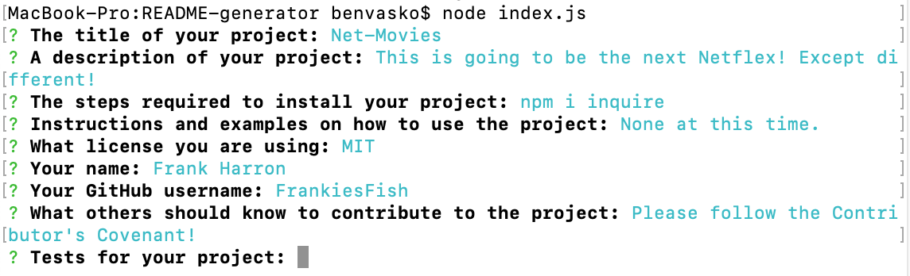
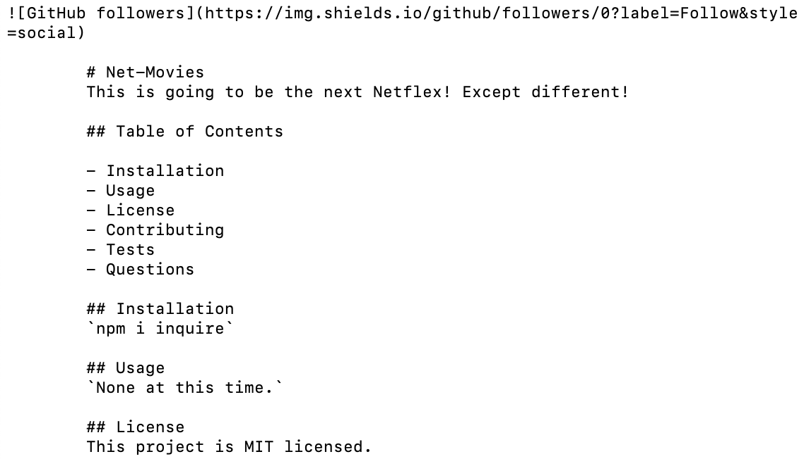

# README-generator
I created a README generator which prompts the user for the information necessary to create a good README for his or her project.
        
## Table of Contents
        
- [Installation](#installation)
- Usage
- License
- Contributing
- Tests
- Questions

## Installation
`npm i inquire`
`npm i axios`

## Usage
`node index.js`

## License
This project is MIT licensed.

## Author
Benjamin Vasko
        
## Contributing
Please follow the Contributor Covenant guidelines.
